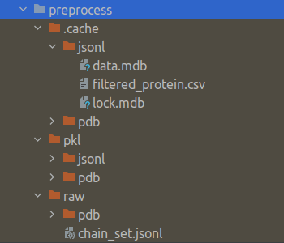

# Preprocess
protein-se3 pre-processes different protein files (`mmcif, pdb and jsonl`) into a unified `lmdb` cache format, which could be loaded for all integrated methods during training.

### Directories Overview
Raw data, intermediate data (metadata.csv and pickle files), unified lmdb-based cache files are organized in the following way.





### 1. Raw Data


The first step of preprocessing is to place raw protein files into `raw` folder (take `.pdb` files for example):

```
├── raw
│   └── pdb/
│   │   ├── 12as.pdb
│   │   └── 132l.pdb
```
Then you can run (all proteins in the `raw/pdb` folder will be processed): 

```
python process_pdb_dataset.py 
```

to produce the intermediate data, which will be placed in `preprocess/pkl/pdb` (similar to mmcif and josnl files).


### 2. Intermediate Data


The intermediate files will be organized as follows:
```
├── pkl
│   └── pdb
│       ├── 12as.pkl
│       ├── 132l.pkl
│       └── metadata.csv
```

- One **pickle** file contains the detailed features of a specific protein, like the 3D coordinates of each atoms. 
- While the **meatadata.csv** records basic properties of all proteins, which can be used to quickly filter the proteins with some customized conditions (such as the `minimum length` and the `maximum helix percent`). 


### 3. Build the Lmdb Cache

Once you successfully produce the intermediate data, the final step is to generate the lmdb cache file for training:

```
python build_cache.py
```


Specifically, the customized conditions can be modified in `preprocess/config.yaml`. The generated lmdb cache are organized as:
```
.cache
├── pdb
│   ├── data.mdb
│   ├── filtered_protein.csv
│   └── lock.mdb
```

**Notice** that `_BYTES_PER_PROTEIN` estimates the memory size for each protein's features, while in
```python
# Initialize local cache with lmdb
self._local_cache = lmdb.open(
    self.cache_path, map_size=(1024**3) * 5
)  # 1GB * 5
```
the `map_size` determines the runtime memory to store the cache of all proteins' features (enough memory space must be available).


